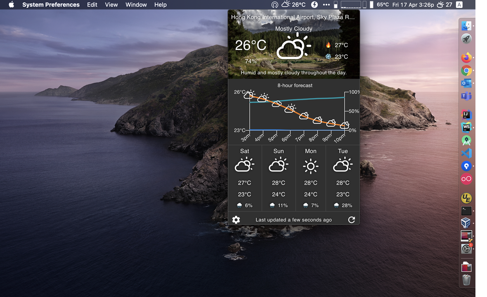
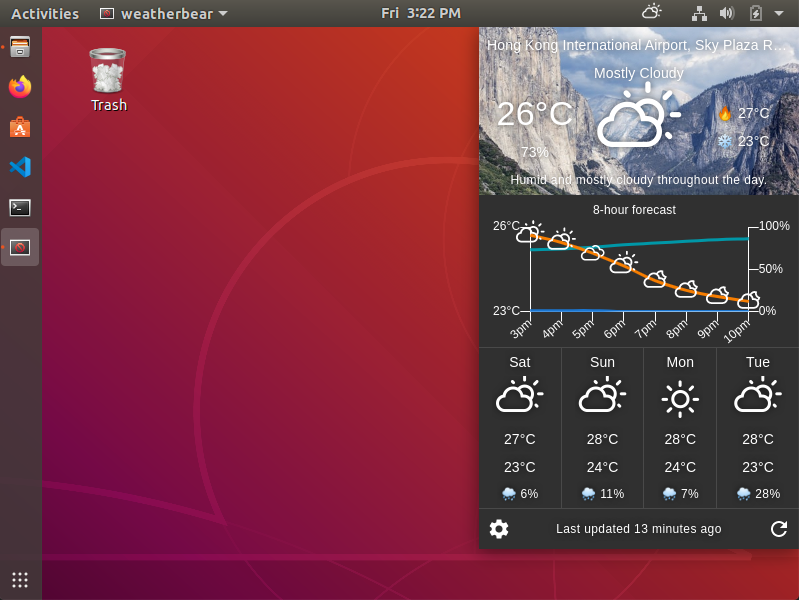
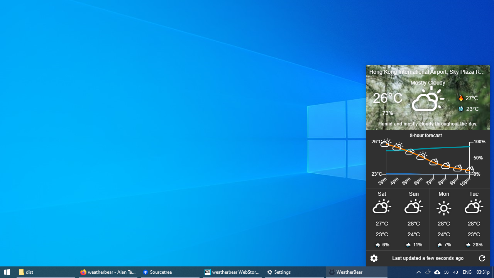
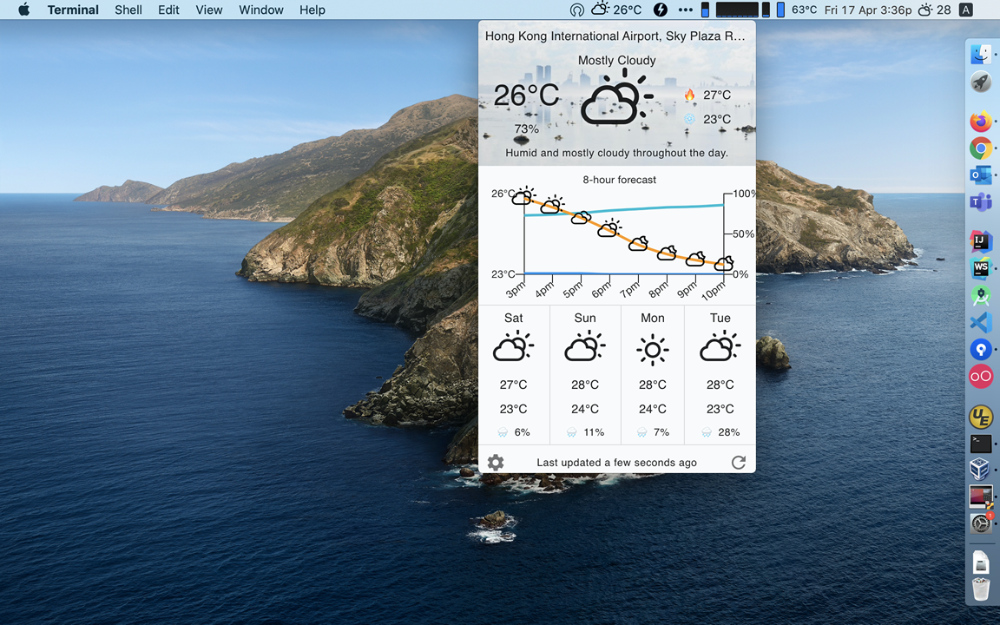
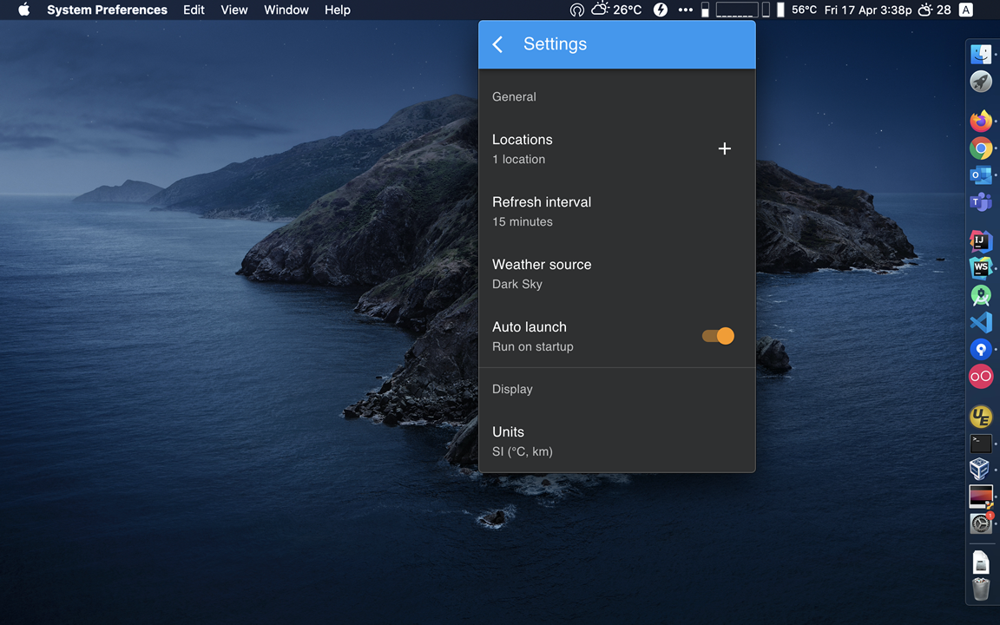

# WeatherBear

[](https://github.com/ayltai/weatherbear/actions)
[](https://app.codacy.com/app/AlanTai/weatherbear/dashboard)
[](https://codecov.io/gh/ayltai/weatherbear)
[](https://sonarcloud.io/dashboard?id=ayltai_weatherbear)
[](https://sonarcloud.io/dashboard?id=ayltai_weatherbear)
[](https://sonarcloud.io/dashboard?id=ayltai_weatherbear)
[](https://sonarcloud.io/dashboard?id=ayltai_weatherbear)

[](https://github.com/ayltai/weatherbear/releases)
[](https://github.com/ayltai/weatherbear/blob/master/LICENSE)

A gorgeous weather app for your Mac, Linux, and Windows. Made with ❤

[](https://buymeacoff.ee/ayltai)

## Features
* Beautiful and easy to use weather app
* Supports switching between different weather data sources - [Dark Sky](https://darksky.net), [AccuWeather](https://www.accuweather.com) and [Weatherbit](https://www.weatherbit.io)
* Customizable weather locations
* Provides only the information that matters - temperature, humidity, precipitation, wind speed and UV index
* Hourly and daily forecast
* Auto reload data and background image
* Supports switching between Celsius and Fahrenheit and different measurement units
* ... and more. Check out the screenshots below!

## Screenshots

#### macOS



#### Ubuntu



#### Windows



#### Light theme



#### Settings
 



## Installation packages

| OS      | Download URL                                                              |
|---------|---------------------------------------------------------------------------|
| macOS   | https://github.com/ayltai/weatherbear/suites/872277729/artifacts/10155420 |
| Linux   | https://github.com/ayltai/weatherbear/suites/872277729/artifacts/10155419 |
| Windows | https://github.com/ayltai/weatherbear/suites/872277729/artifacts/10155421 |

## Development

### Installation
1. Install [NodeJS](https://nodejs.org)
2. Install dependencies
   ```sh
   npm i
   ```

### Configuration

#### Dark Sky API
1. <del>Get an API key from [Dark Sky](https://darksky.net/dev) </del> (Dark Sky is no longer accepting new signups)
2. Specify the API key for using Dark Sky:
   ```sh
   export REACT_APP_DARK_SKY_API_KEY=XXXXX
   ```

#### AccuWeather API
1. Get an API key from [AccuWeather](https://developer.accuweather.com/)
2. Specify the API key for using AccuWeather:
   ```sh
   export REACT_APP_ACCU_WEATHER_API_KEY=XXXXX
   ```

### Weatherbit API
1. Get an API key from [Weatherbit](https://www.weatherbit.io/api)
2. Specify the API key for using Weatherbit:
   ```sh
   export REACT_APP_WEATHER_BIT_API_KEY=XXXXX
   ```

#### Google Maps JavaScript API
1. Go to [Google Cloud Platform Console](https://developers.google.com/maps/documentation/javascript/get-api-key) to get an API key
2. Restrict your API key to the following APIs:
   * Geocoding API
   * Maps JavaScript API
   * Places API
3. Specify the API key for using Google Maps JavaScript APIs:
   ```sh
   export REACT_APP_GOOGLE_MAPS_API_KEY=xxxxx
   ```
#### Unsplash API
Specify the URL of your Unsplash API proxy:
```sh
export REACT_APP_UNSPLASH_API_ENDPOINT=https://unsplash-api-proxy.appspot.com
```

### How to run in development environment
```sh
npm run electron
```

### How to create a production build
```sh
npm run build
```

### How to create installation packages

For macOS:
```sh
npm run package:mac
```

For Linux:
```sh
npm run package:nix
```

For Windows:
```sh
npm run package:win
```

## Acknowledgements
This software is made with the support of open source projects:
* [NodeJS](https://nodejs.org)
* [React](https://github.com/facebook/react)
* [React Router](https://reacttraining.com/react-router)
* [Create React App](https://github.com/facebook/create-react-app)
* [Material UI](https://material-ui.com)
* [Unsplash](https://github.com/unsplash/unsplash-js)
* [Chart.js](https://www.chartjs.org)
* [menubar](https://github.com/maxogden/menubar)
* [moment.js](https://momentjs.com)
* [Request](https://github.com/request/request)
* [node-auto-launch](https://github.com/Teamwork/node-auto-launch)
* [i18next](https://www.i18next.com)
* [react-i18next](https://react.i18next.com)
* [Electron](https://www.electronjs.org)
* [Electron Builder](https://github.com/electron-userland/electron-builder)
* [Concurrently](https://github.com/kimmobrunfeldt/concurrently)
* [wait-on](https://github.com/jeffbski/wait-on)
* [Nock](https://github.com/nock/nock)
* [ESLint](https://eslint.org)
* [Stylelint](https://stylelint.io)
* [Enzyme](https://airbnb.io/enzyme)

... and closed source services:
* [Google Maps JavaScript API](https://developers.google.com/maps/documentation)
